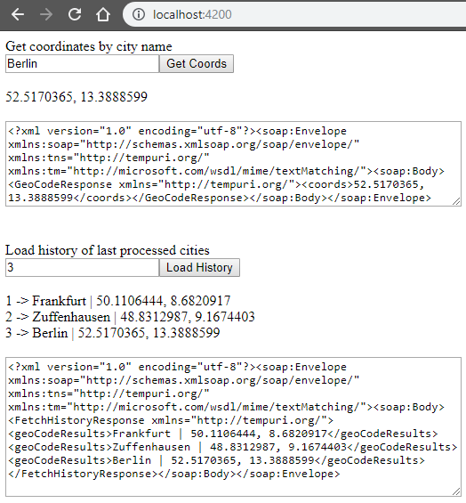

# Geocode Application

Geocoding application with a SOAP interfaces and an angular app for testing.


<br/><br/>

## Local Dev Setup

```
git clone https://github.com/servrox/soap-geolocation.git
cd soap-geolocation
npm run inst
npm run dev
```

```
UI: http://localhost:4200
Soap Service: http://localhost:8000/wsdl?wsdl
```

## Built With

- [Angular CLI](https://github.com/angular/angular-cli) - version 8.2.0
- [ngx-soap](https://github.com/lula/ngx-soap) - version 0.6.0

- [express](https://expressjs.com/) - version 4.17.1
- [soap](https://github.com/vpulim/node-soap) - version 0.29.0
- [opencage-api-client](https://github.com/tsamaya/opencage-api-client) - version 0.5.0

## Authors

- **Marcel Mayer**
